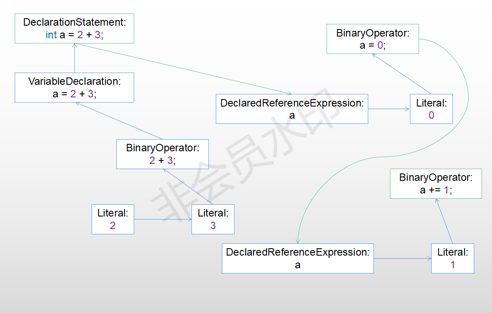
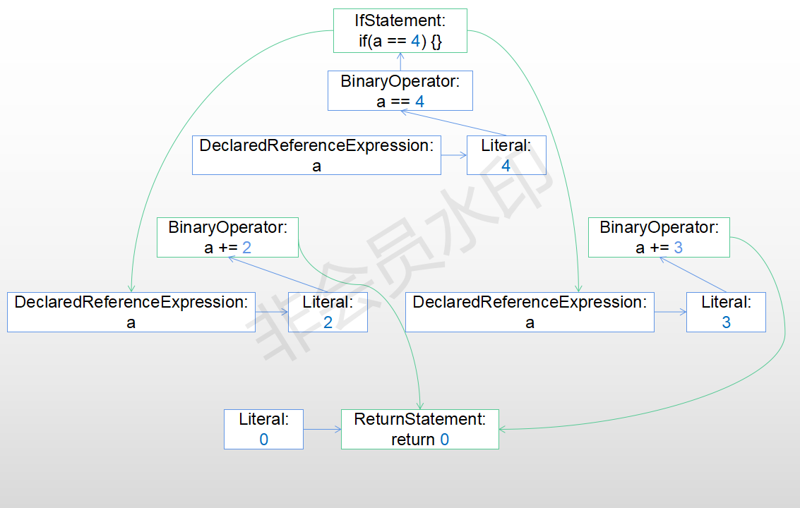
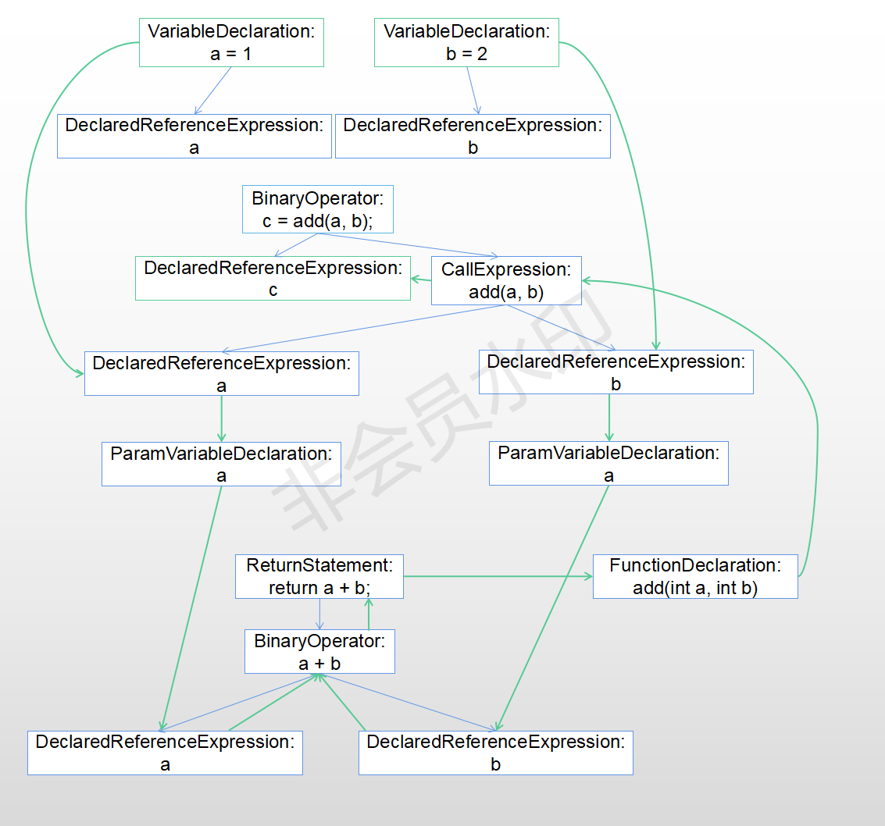
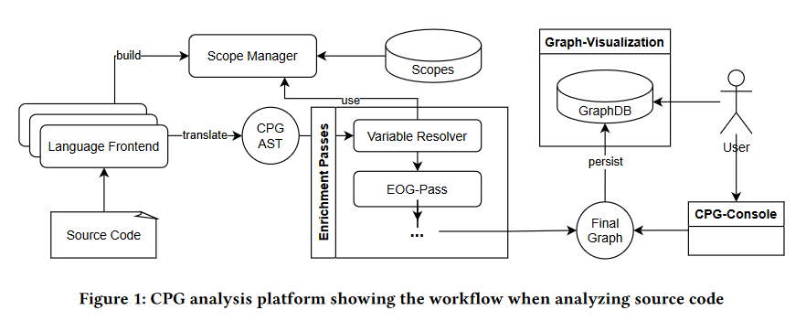
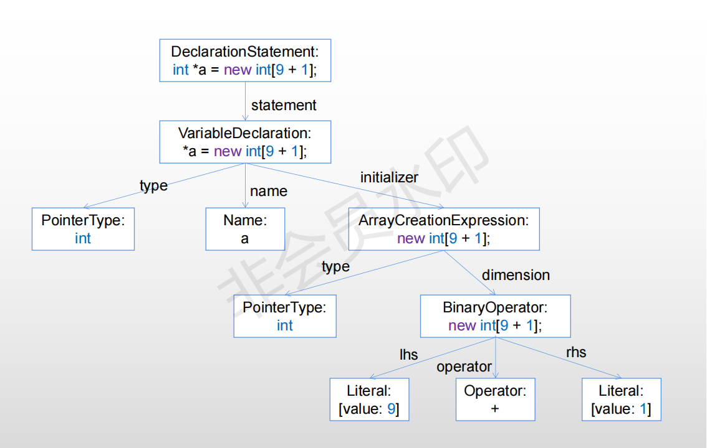
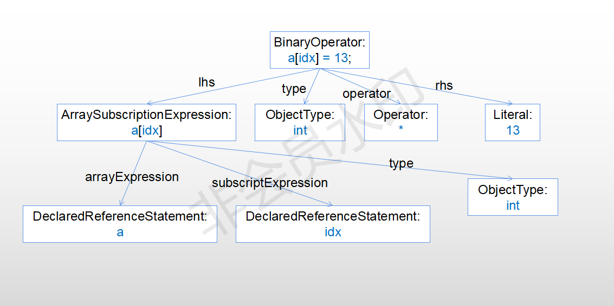

[cpg](https://github.com/Fraunhofer-AISEC/cpg) 是一个跨语言代码属性图解析工具，它目前支持C/C++ (C17), Java (Java 13)并且对Go, LLVM, python, TypeScript也有支持，在这个项目的根目录下:

- cpg-core为cpg解析模块的核心功能，主要包括将代码解析为图，core模块只包括对C/C++/Java的支持。

- cpg-analysis为基于代码属性图的代码分析规则，比如[ValueEvaluator](https://github.com/Fraunhofer-AISEC/cpg/blob/main/cpg-analysis/src/main/kotlin/de/fraunhofer/aisec/cpg/analysis/ValueEvaluator.kt)主要基于DFG的回溯遍历计算某一表达式的值。

- cpg-neo4j将解析结果导入到neo4j数据库

- cpg-language-xxx为对xxx语言的支持'

- cpg-console包含针对用户端的功能，比如bug检测:[OutOfBoundsCheck](https://github.com/Fraunhofer-AISEC/cpg/blob/v6.1.0/cpg-console/src/main/kotlin/de/fraunhofer/aisec/cpg/analysis/OutOfBoundsCheck.kt),[NullPointerCheck](https://github.com/Fraunhofer-AISEC/cpg/blob/v6.1.0/cpg-console/src/main/kotlin/de/fraunhofer/aisec/cpg/analysis/NullPointerCheck.kt)。

cpg将编程语言抽象为1个特性([Trait](https://github.com/Fraunhofer-AISEC/cpg/blob/main/cpg-core/src/main/kotlin/de/fraunhofer/aisec/cpg/frontends/LanguageTraits.kt))集合，语言特性是一组编程语言所共有的特性或特性。任何支持它们的语言都应该实现所需的trait接口。示例可以是对指针的支持、对模板或泛型的支持。


# 1.Graph Structure

这一部分主要介绍cpg提供的图结构，这些结构旨在提供大多数面向对象语言（如C++、Java或Go）中的语言特性的超集。这包括结构元素，例如函数、方法、类以及表达式/语句，例如调用、运算符、文本或条件。

## 1.1.Abstract Syntax Tree

树的根是[TranslationUnitDeclaration](https://github.com/Fraunhofer-AISEC/cpg/blob/main/cpg-core/src/main/kotlin/de/fraunhofer/aisec/cpg/graph/declarations/TranslationUnitDeclaration.kt)节点，它表示一个文件中包含的代码。树中存在不同类型的AST子节点，每个子节点表示程序中的不同语义：

- `Structural Entities` 表示为代码提供其结构的实体。比如代表 `namespaces`, `classes`, `structs` 的结点。

- `Value Declarations` 用于建模局部变量、参数、函数、方法和构造函数。

- `Nodes of Program Execution` 它为语句和表达式建模。

    * 语句是按顺序执行的语法单元，因此构成命令式程序的程序逻辑。 
  
    * 相比之下，表达式是计算值的语法单位，属于特定的值类型。表达式可以是嵌套的，也可以是语句的子级。


## 1.2.Control Flow and Evaluation Order

cpg将控制流图（CFG）的概念改编为评估顺序图（evaluation order graph, EOG），它按照语句和表达式被求值的顺序相互连接，以在更细粒度级别上表示控制流。这对于正确捕获来自表达式内部执行顺序的副作用是必要的。可以说EOG是expression-level CFG。

比如对下面代码:

```cpp
int a = 2 + 3;
a = 0;
a += 1;
```

EOG为:



- 绿框为3个语句对应的AST根节点，蓝框为其下AST子结点。

- 蓝线连接同一语句下的AST结点，绿线连接不同语句的AST结点。

可以看出：

- EOG的连接顺序为AST结点后序遍历顺序

- 连接的结点都是对应的表达式或者语句访问顺序。

通常，EOG的构造对应后序遍历，当然也存在一些例外情况：

- 显式更改程序控制流的构造函数，如 `if` 或其他条件表达式。

- 表示不按代码出现的顺序执行的代码的节点，例如，在 `for (initializer; condition; iteration) body();` 中 `body();` 在 `initializer` 之后执行，在 `iteration` 之前执行。

分支语句的根节点在分支表达式（例如条件或选择器）之后和分支目标之前连接，以允许已经遍历分支表达式的算法在必须处理分支之前获得关于语义根的信息。


对于下面分支代码:

```cpp
if (a == 4)
    a += 2;
else
    a += 3;
return 0;
```

其EOG如下:




## 1.3.Data Flow

处理数据的操作或实体在CPG内的数据流图（DFG）中表示。要对程序中的数据流进行建模，以下DFG边连接节点：

- (1).如果父结点的值取决于子结点的值，则子对象包含其父结点的边。比如 `BinaryOperator:2 + 3` 指向其父结点 `VariableDeclaration:a = 2 + 3`。

- (2).如果语句对被引用变量进行写入，那么被引用变量是DF edge的起始结点；如果语句读取被引用变量，那么被引用变量是DF edge的开始。比如 `a = 1; if (a == 4) xxx` 中存在从 `DeclaredReferenceExpression: a`(`a = 1;` 中的 `a`) 指向 `BinaryOperator: a== 4` 的DF edge。

- (3).函数调用时会建立从 `CallExpression` 对应的被引用变量到被调用参数之间的DF edge，以及被调用者定义和该 `CallExpression` 之间也会建立DF edge，如下面示例所示: `DeclaredReferenceExpression` 和 `ParamVariableDeclaration` 之间有数据流，`FunctionDeclaration` 和 `CallExpression` 之间也有数据流。

    * 绿边为data flow edge

    * 蓝边为普通AST edge（这里只包含了部分AST信息）



- (4).如果控制流敏感（control-flow-sensitive）的数据流分析被执行，那么对于一个变量 (`DeclaredReferenceExpression`)，在它最后一次被写入的地方和对应引用的位置会有1条数据流

- (5).对于控制流不敏感的数据流分析，变量引用 (`DeclaredReferenceExpression`)和变量定义（`VariableDeclaration`）之间存在数据流。


对于具体DFG建立规则，可以参考[cpg DFG](https://github.com/Fraunhofer-AISEC/cpg/blob/v6.1.0/cpg-core/specifications/dfg.md)

## 1.4.Additional program semantics

- 程序和所用语言的类型系统是通过添加其复杂的层次结构作为节点和边来建模的，形成一个类型子图，这有助于通过允许根据细微差别的语言语义进行区分，对语言级语义进行建模，以提高精度。

- `REFERS_TO` 连接引用和定义。(每个 `DeclaredReferenceExpression` 都有1个成员变量[refersTo](https://github.com/Fraunhofer-AISEC/cpg/blob/v6.1.0/cpg-core/src/main/java/de/fraunhofer/aisec/cpg/graph/statements/expressions/DeclaredReferenceExpression.java#L52)指向对应变量定义的位置)

- `INVOKES` 连接调用语句和调用对象。（每个 `CallExpression` 都有成员变量[invokeEdges](https://github.com/Fraunhofer-AISEC/cpg/blob/v6.1.0/cpg-core/src/main/kotlin/de/fraunhofer/aisec/cpg/graph/statements/expressions/CallExpression.kt#L55)）指向其可能的调用对象。


# 2.核心架构和实现

CPG项目由围绕一个库构建的多个工具组成，用于以基于Java/Kotlin的开源实现3的形式对源代码进行迭代图形构建。图1描述了将源代码转换为图形表示的工作流，以及用户对其进行的可视化和分析。

代码解析的核心部分由 `cpg-core` 完成，用户输入由 `cpg-console` 完成。



## 2.1.语言前端(Language Frontends)

源代码文件通过其文件扩展名发送到特定语言的**前端**。然后，**前端**可以使用针对特定语言的AST解析库解析源代码(针对C/C++使用[eclipse CDT](https://www.eclipse.org/cdt/)，针对Java采用[Java Parser](https://javaparser.org/))。语言前端应执行以下任务:

- 特定语言的AST被转换为独立于语言的cpg AST结构，以方便建立独立于特定语言的图结构

- 隐式存在但未位于源代码中的实体将显式添加到图中，例如隐式 `this` 字段和缺少的返回语句(`void` 函数，比如下面代码片段中 `swap` 函数在解析后补充了 `ReturnStatement:return;`)

```cpp
void swap(int *p, int *q) {
    int t = *p;
    *p = *q;
    *q = t;
}

int main() {
    int a = 2, b = 1;
    swap(&a, &b);
    int c = a + 1;
    return 0;
}
```

- 标识符被收集在scope tree中，以便以后以模糊的方式解析对名称的访问。在cpg AST的每个结点中，都有一个局部变量[scope](https://github.com/Fraunhofer-AISEC/cpg/blob/v6.1.0/cpg-core/src/main/kotlin/de/fraunhofer/aisec/cpg/graph/Node.kt#L89)指向一个[Scope](https://github.com/Fraunhofer-AISEC/cpg/blob/v6.1.0/cpg-core/src/main/kotlin/de/fraunhofer/aisec/cpg/graph/scopes/Scope.kt)对象，每个 `scope` 对象会用1个ASTNode来标识。以上面代码为例:

    * 整个代码对应的`TranslationUnitDeclaration` 会对应到一个[GlobalScope](https://github.com/Fraunhofer-AISEC/cpg/blob/v6.1.0/cpg-core/src/main/kotlin/de/fraunhofer/aisec/cpg/graph/scopes/GlobalScope.kt)(记作 `globalScope`)对象中，该 `GlobalScope` 对象对应的ASTNode就是该 `TranslationUnitDeclaration`

    * `swap` 和 `main` 函数对应的 `FunctionDeclaration` 的 `scope` 域指向 `globalScope`

    * `swap` 和 `main` 函数定义下的 `CompoundStatement`(函数体) 的 `scope` 域分别指向2个[FunctionScope](https://github.com/Fraunhofer-AISEC/cpg/blob/v6.1.0/cpg-core/src/main/kotlin/de/fraunhofer/aisec/cpg/graph/scopes/FunctionScope.kt)(分别记作 `functionScope1, functionScope2`)，`functionScope1, functionScope2` 对应的ASTNode分别为2个 `FunctionDeclaration` 结点

    * `int t = *p;`, `int c = a + 1;` 的 `scope` 域分别指向2个[BlockScope](https://github.com/Fraunhofer-AISEC/cpg/blob/v6.1.0/cpg-core/src/main/kotlin/de/fraunhofer/aisec/cpg/graph/scopes/BlockScope.kt)，这2个 `BlockScope` 对应的ASTNode分别为2个函数定义下的 `CompoundStatement`

在 `cpg-core` 中，已经实现了针对C/C++/Java的[前端](https://github.com/Fraunhofer-AISEC/cpg/tree/v6.1.0/cpg-core/src/main/kotlin/de/fraunhofer/aisec/cpg/frontends)，而 `cpg-language-xxx` 实现了针对xxx语言的前端。


## 2.2.ScopeManager

在大多数编程语言中，名称的声明不是全局有效的，但其有效性仅限于与语言构造相关的区域，例如类或函数。这个有效区域被称为作用域(scope)。当前端遍历AST节点时，作用域管理器跟踪当前活动的作用域堆栈。这允许按绝对或相对名称跟踪和解析声明，并管理绑定到封闭语言功能（例如循环、`try` 语句）范围的控制流跳转。在语言前端构建作用域之后，作用域管理器持有多个作用域树。

在全局存在一个[ScopeManager](https://github.com/Fraunhofer-AISEC/cpg/blob/v6.1.0/cpg-core/src/main/kotlin/de/fraunhofer/aisec/cpg/ScopeManager.kt)对象，通过 `HashMap` 的方式将ASTNode映射为 `Scope`

## 2.3.Passes

cpg前端产生部分连接的AST树。然后，通过隐式执行信息和程序语义（如使用引用、数据流和求值顺序），使用[Passes](https://github.com/Fraunhofer-AISEC/cpg/blob/v6.1.0/cpg-core/src/main/kotlin/de/fraunhofer/aisec/cpg/passes/Pass.kt)来丰富cpg。
比如:

- [DFGPass](https://github.com/Fraunhofer-AISEC/cpg/blob/v6.1.0/cpg-core/src/main/kotlin/de/fraunhofer/aisec/cpg/passes/DFGPass.kt)负责生成DFG。

- [ControlFlowSensitiveDFGPass](https://github.com/Fraunhofer-AISEC/cpg/blob/v6.1.0/cpg-core/src/main/kotlin/de/fraunhofer/aisec/cpg/passes/ControlFlowSensitiveDFGPass.kt)负责生成control-flow sensitive DFG。

- [EvaluationOrderGraphPass](https://github.com/Fraunhofer-AISEC/cpg/blob/v6.1.0/cpg-core/src/main/kotlin/de/fraunhofer/aisec/cpg/passes/EvaluationOrderGraphPass.kt)负责生成EOG。

这些语义是在独立于语言的AST节点之间构建的，并且它们本身独立于特定编程语言。然而，它们仍然允许特定语言的定制。

当需要graph中的语义时，某些 `Pass` 取决于其他 `Pass` 的先前执行。比如 `ControlFlowSensitiveDFGPass` 依赖于 `DFGPass, EvaluationOrderGraphPass`。后2者只遍历了AST，而 `ControlFlowSensitiveDFGPass` 还需遍历EOG。关于这些Pass是怎么实现的，这个以后再探索。

最后，`Pass` 也支持推理。对于在源代码中不直接可见的实体，节点将被添加并标记为 `IMPLICIT`，如果缺少源代码，则为 `INFERRED`。


# 3.使用

我用API方式使用cpg，相比Joern来说cpg的API用起来感觉好用很多，不过cpg好像并不包括控制依赖分析，其它的Joern能解析出的结果cpg基本都能解析，通过下面3行代码可以获得cpg的解析结果:

```java
public class Main {
  public static void main() {
    File file = new File(sourceFile);
    TranslationConfiguration configuration = new TranslationConfiguration.Builder().sourceLocations(file).defaultPasses().defaultLanguages().build();
    TranslationManager translationManager = TranslationManager.builder().config(configuration).build();
    TranslationResult translationResult = translationManager.analyze().get();
  }
}
```

- `sourceFile` 是输入文件路径

- `configuration` 为解析配置，其中

  * `defaultPasses()` 配置默认需要进行哪些程序分析

  * `defaultLanguages()` 配置默认分析的语言，默认C/C++/Java

```kotlin
fun defaultPasses(): Builder {
  registerPass(TypeHierarchyResolver()) // 类型解析
  registerPass(JavaExternalTypeHierarchyResolver()) // 针对Java才用到
  registerPass(ImportResolver()) 
  registerPass(VariableUsageResolver()) // 将变量引用DeclaredReferenceExpression和定义该变量的位置DeclarationStatement连接
  registerPass(CallResolver()) // 创建函数调用图
  registerPass(DFGPass()) // 创建流不敏感数据流图
  registerPass(FunctionPointerCallResolver())
  registerPass(EvaluationOrderGraphPass()) // 创建Evaluation-Order Graph
  registerPass(TypeResolver())
  registerPass(ControlFlowSensitiveDFGPass()) // 创建流敏感数据流图
  registerPass(FilenameMapper())
  return this
}

fun defaultLanguages(): Builder {
  registerLanguage(CLanguage())
  registerLanguage(CPPLanguage())
  registerLanguage(JavaLanguage())
  return this
}
```

- `translationManager.analyze()` 的部分代码为

```kotlin
fun analyze(): CompletableFuture<TranslationResult> {
  val result = TranslationResult(this, ScopeManager()) // 创建空result
  executedFrontends = runFrontends(result, config) // 调用语言前端生成初始的cpg AST
  for (pass in config.registeredPasses) { // 用每一个pass解析cpg AST生成其它结果（比如DFG, EOG）
    bench = Benchmark(pass.javaClass, "Executing Pass", false, result)
    if (pass.runsWithCurrentFrontend(executedFrontends)) {
      executedPasses.add(pass)
      pass.accept(result)
    }
  }
}
```


# 4.程序分析

cpg在 `cpg-analysis` 下定义了一些程序分析规则，包括计算表达式的值、不可达代码分析等等。基本是通过图的遍历实现的，这里就介绍以下表达式求值。

表达式求值有点类似于常量传播，不过区别在于这里是通过[Data Flow Graph](https://github.com/Fraunhofer-AISEC/cpg/blob/v6.1.0/cpg-core/specifications/dfg.md)的遍历实现，对应的代码为 [ValueEvaluator.evaluate](https://github.com/Fraunhofer-AISEC/cpg/blob/v6.1.0/cpg-analysis/src/main/kotlin/de/fraunhofer/aisec/cpg/analysis/ValueEvaluator.kt#L73)，具体规则参考[evaluateInternal函数](https://github.com/Fraunhofer-AISEC/cpg/blob/v6.1.0/cpg-analysis/src/main/kotlin/de/fraunhofer/aisec/cpg/analysis/ValueEvaluator.kt#L80)(还有1个更高级的版本[MultiValueEvaluator](https://github.com/Fraunhofer-AISEC/cpg/blob/v6.1.0/cpg-analysis/src/main/kotlin/de/fraunhofer/aisec/cpg/analysis/MultiValueEvaluator.kt)):

- 返回值主要为常量值或者 `canNotResolve`，如果不能确定值的变量，那么返回的可能就是 `canNotResolve`。

- 如果访问的AST结点为 [Literal](https://github.com/Fraunhofer-AISEC/cpg/blob/v6.1.0/cpg-core/src/main/kotlin/de/fraunhofer/aisec/cpg/graph/statements/expressions/Literal.kt)类型，那么直接返回其值。

- 如果是 `DeclaredReferenceExpression`，那么沿着DFG回溯，这里需要注意的是，data flow必须唯一，如果有多个DFG边指向该变量引用，也就是该变量可能值有多个，那么返回 `canNotResolve`。

- 对于算术运算表达式，则先分别计算其左右值，如果不是 `canNotResolve`，那么直接计算其值。


# 5.Bug检测

这一部分为cpg的部分用户功能，放在 `cpg-console` 模块中。

cpg目前支持2种类型的bug检测,out of bound和空指针访问，这2种bug clang static analyzer(CSA)已有实现，不过CSA基于符号执行，cpg基于data flow graph的反向遍历。

## 5.1.Out of Bound Check

CSA中的实现可参考[知乎介绍](https://www.zhihu.com/question/58327378)，clang对应的代码为[ArrayBoundChecker](https://github.com/llvm/llvm-project/blob/llvmorg-15.0.0/clang/lib/StaticAnalyzer/Checkers/ArrayBoundChecker.cpp)，[ArrayBoundCheckerV2](https://github.com/llvm/llvm-project/blob/llvmorg-15.0.0/clang/lib/StaticAnalyzer/Checkers/ArrayBoundCheckerV2.cpp)。

可以检查出由数组访问造成的溢出读写，比如 `array[idx] = 1;`，但是数组访问必须满足以下条件：

- `idx` 必须是常量表达式（索引可以用变量，但是其值必须是常量）

- 数组长度必须是常量，且长度通过 `new Type[n];` 定义，`n` 为常量表达式

首先给出以下示例:

```cpp
#include <iostream>
using namespace std;

int main() {
    int *a = new int[9 + 1];
    int i = 10;
    int idx = i + 1;
    a[idx] = 13;
    return 0;
}
```

其中有几个比较重要的AST结点类型:

- [ArrayCreationExpression](https://github.com/Fraunhofer-AISEC/cpg/blob/v6.1.0/cpg-core/src/main/kotlin/de/fraunhofer/aisec/cpg/graph/statements/expressions/ArrayCreationExpression.kt): 表示由 `new Type[n]` 组成的AST结点，比如:



- [ArraySubscriptionExpression](https://github.com/Fraunhofer-AISEC/cpg/blob/v6.1.0/cpg-core/src/main/kotlin/de/fraunhofer/aisec/cpg/graph/statements/expressions/ArraySubscriptionExpression.kt):表示数组访问语句 `array[index]`, `array` 和 `index` 都属于 `Expression` 类（通常为 `DeclaredReferenceExpression`） 



- [VariableDeclaration](https://github.com/Fraunhofer-AISEC/cpg/blob/v6.1.0/cpg-core/src/main/java/de/fraunhofer/aisec/cpg/graph/declarations/VariableDeclaration.java): 变量定义结点，在图1中已有示例

- [DeclaredReferenceExpression](https://github.com/Fraunhofer-AISEC/cpg/blob/v6.1.0/cpg-core/src/main/java/de/fraunhofer/aisec/cpg/graph/statements/expressions/DeclaredReferenceExpression.java): 变量引用结点，表示对变量的使用，每个 `DeclaredReferenceExpression` 都会有一个成员变量 `refersTo` 指向定义该变量的 `VariableDeclaration` 结点。比如图2中的 `DeclaredReferenceExpression: a` 指向图1中的 `VariableDeclaration: *a = new int[9 + 1];`

检查数组越界访问按以下方式进行，检查对象为 `ArraySubscriptionExpression` 结点，对于某一个 `ArraySubscriptionExpression`:

- 取出改数组表达式的索引（示例中为图2 `DeclaredReferenceExpression:idx`），计算其值（示例中值为 `11`），如果不是常量则退出。

- 找到表达式数组对应的 `DeclaredStatementExpression`（示例中为图2 `DeclaredStatementExpression:a`），找到其对应的 `VariableDeclaration`（示例中为图1 `VariableDeclaration: *a = new int[9 + 1];`），查找有没有 `ArrayCreationExpression`，没有则退出（`int a[100];` 这种语句都不行）。

- `Type[n]` 中的 `n` 对应着数组长度表达式，计算其值（示例中为 `10`），不是常量则退出。

- 比较索引和长度的值，如果索引 >= 长度则报出越界访问。

参考第3部分，表达式的计算核心是回溯DFG，对于计算索引 `idx` 的值，上述示例比较重要的DFG包括下面4个，计算的过程是从最后1个data flow往前回溯

- `VariableDeclaration:i = 10 --------> DeclaredReferenceExpression:i`，其中 `VariableDeclaration:i = 10` 对应的 `initializer` 为 `Literal: 10`，因此 `DeclaredReferenceExpression:i` 的结果为 `10`

- `VariableDeclaration:idx = i + 1 --------> DeclaredReferenceExpression:idx` (从语句 `int idx = i + 1;` 指向 `a[idx] = 13;`)，计算idx时，追溯到 `VariableDeclaration:int idx = i + 1`，对应的 `initializer` 为 `BinaryOperator: i + 1`，左值为 `DeclaredReferenceExpression:i`，右值为 `Literal:1`，递归回溯后，左值结果为 `10`，因此 `DeclaredReferenceExpression:idx` 的值为 `11`

没有用到的data flow包括:

- `Literal:10 --------> VariableDeclaration:i = 10`

- `BinaryOperator:i + 1 --------> VariableDeclaration:idx = i + 1`


同理，可以计算出 `a` 的长度为 `10`，因此存在越界访问。


## 5.2.Null Pointer Check

CSA中的实现可参考[NullabilityChecker](https://github.com/llvm/llvm-project/blob/llvmorg-15.0.0/clang/lib/StaticAnalyzer/Checkers/NullabilityChecker.cpp)， GoSSIP团队也在CSA的基础上实现了新的空指针解引用检测算法[NewDereferenceChecker](https://github.com/GoSSIP-SJTU/TripleDoggy/blob/master/tools/clang/lib/StaticAnalyzer/Checkers/NewDereferenceChecker.cpp)。

在cpg中空指针的检测规则比较简单，如果出现指针访问（数组，成员变量，成员方法），对其对应指针变量 `base` 进行求解，如果可能为 `nullptr`（必须由 `nullptr` 初始化，`NULL` 和默认初始化都不行）。

求解是对 `base` 变量所有的DFG前驱进行求解，下面示例也会检测出 `s->i = 1;` 存在空指针访问，这是由于存在错误数据流 `VariableDeclaration:*s = nullptr --------> DeclaredReferenceExpression:s`(line 11)


```cpp
struct S1 {
	char c1; //1个字节
	int i;   //4个字节
	char c2; // 1个字节
};

int main() {
    struct S1 *s = nullptr; // 可以识别nullptr关键字,NULL不行
    s = new S1();
    s->i = 1;
    return 0;
}
```

# 6.参考文献

[paper地址](https://arxiv.org/abs/2203.08424)

```
@article{
    Weiss_A_Language-Independent_Analysis_2022,
    author = {Weiss, Konrad and Banse, Christian},
    doi = {10.48550/arXiv.2203.08424},
    title = {{A Language-Independent Analysis Platform for Source Code}},
    year = {2022}
}
```